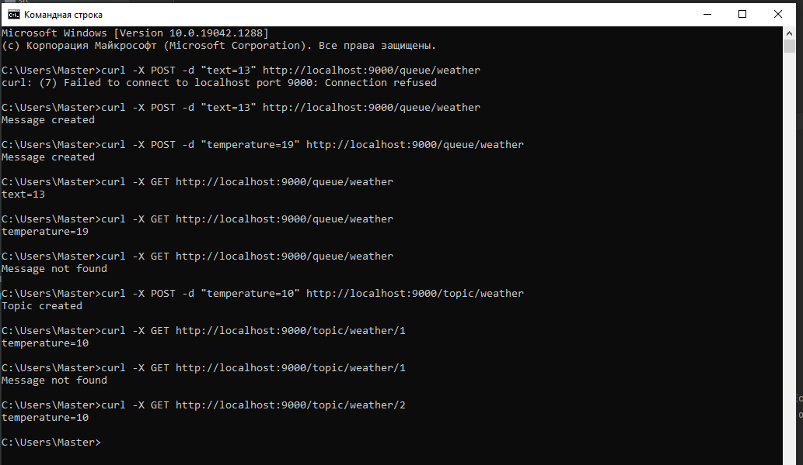

# job4j_pooh

+ [О проекте](#О-проекте)
+ [Технологии](#Технологии)
+ [Сборка и запуск](#Сборка-и-запуск)
+ [Использование](#Использование)
+ [Контакты](#Контакты)

## О проекте

Приложение запускает Socket и ждет клиентов. Клиенты могут быть двух типов: отправители (publisher), получатели 
(subscriber). В качестве клиента использовался cURL. В качестве протокола используется HTTP. 

## Технологии

+ Сборщик проектов **Maven**;
+ Backend - **Java 14**, **Multithreading**;
+ Непрерывная интеграция - **Travis CI**;
+ Тесты - **JUnit 4**;
+ Покрытие кода тестами - **Codecov**;
+ Инструмент для анализа стиля кода - **Checkstyle**;

## Сборка и запуск

### Запуск через терминал

1.Собрать jar через Maven

`mvn install -Dmaven.test-skip=true`

2.Запустить jar файл

`java -jar target/pooh.jar`

### Запуск через IDE

Перейти к папке `src/main/java` и файлу `ru.job4j.pooh.PoohServer`

## Использование

У приложения есть два режима: **Queue** и **Topic**.

***Queue***

Отправитель посылает сообщение с указанием очереди. Получатель читает первое сообщение и удаляет его из очереди. Если 
приходят несколько получателей, то они читают из одной очереди. Уникальное сообщение может быть прочитано, только одним 
получателем.

Пример запросов.

`POST /queue/weather -d "temperature=18"`

`queue` указывает на режим очередь.

`weacher` указывает на имя очереди. Если очереди нет в сервисе, то нужно создать новую.

`GET /queue/weather`

Ответ: temperature=18

---

***Topic***

Отправитель посылает сообщение с указанием темы. Получатель читает первое сообщение и удаляет его из очереди. Для 
каждого потребителя должны быть уникальная очередь потребления.

`POST /topic/weather -d "temperature=18"`

`GET /topic/weather/1`

`topic` указывает на режим темы.

`weather` имя темы, если темы нет, то нужно создать новую.

1 - ID клиента.

Ответ temperature=18

---

Пример запросов и ответов через клиента cURL:

## Контакты

Становов Семён Сергеевич

Email: sestanovov@gmail.com

Telegram: [@stanovovss](https://t.me/stanovovss)